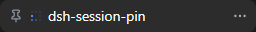
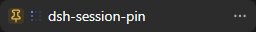

# 📌 dsh-session-pin

<p align="center">
  <a href="README.md">English</a> ·
  <a href="README.zh-CN.md">中文</a> ·
  <a href="README.es.md">Español</a> ·
  <a href="README.pt.md">Português</a> ·
  <a href="README.hi.md">हिन्दी</a>
</p>

<p align="center">
  
  <a href="https://github.com/topics/dsh-plugin"></a>
  
  
</p>

> **Fixe as conversas que importam.** Um plugin de duas faces (host + navegador) para o [DeepSeek Harness](https://github.com/deepseek-ai/deepseek-harness) que coloca um alfinete de um clique em cada linha de sessão — cinza ao passar o mouse, âmbar enquanto fixada — move as sessões fixadas para o topo do grupo do espaço de trabalho e mantém o alfinete entre reinícios e navegadores.

## Por que fixar?

As listas de sessões ordenam por atividade recente: a conversa em que você confia a semana inteira afunda aos poucos, e cada novo chat a enterra ainda mais. Arrastar linhas no modo de ordenação Manual funciona, mas ninguém descobre — e chats fixados que continuam sendo reordenados pela atividade são exatamente o que os usuários de outros agentes de programação reclamam. O `dsh-session-pin` oferece a experiência de um clique:

```
┌─ Sessões ──────────────────────────────┐
│ 📌 Implementar o login         3h      │  ← fixada: alfinete âmbar sempre visível
│   Corrigir o bug de auth       1h      │  ← passar o mouse mostra um alfinete cinza
│   Refatorar a camada de BD     2d      │
└─────────────────────────────────────────┘
```

## 📸 Demonstração

Passe o mouse sobre uma linha para revelar o alfinete cinza; clique para fixar — âmbar e no topo, continua fixado após recarregar. (Capturas reais de uma execução do `dsh web`.)

<p align="center">
  
  
</p>

## ✨ Recursos

- 🧷 **Alfinete ao passar o mouse** — um alfinete cinza surge à esquerda do título ao passar o mouse; sessões fixadas mantêm um alfinete âmbar fixo. Um clique alterna, sem abrir a sessão.
- 📌 **Ordenação no topo** — fixar move a sessão para a frente da conta do espaço de trabalho pelo RPC público `workspace.insertSessionBefore`. Na ordenação **Manual** do núcleo a posição permanece — sem reordenação por atividade.
- 💾 **Fixação persistente** — a metade host registra o namespace de configurações `session-pin`; a metade navegador escreve pelos RPCs padrão `settings.*`. Nas builds atuais do DSH o proxy web serve apenas seus namespaces permitidos, então até essa lista passar para `settings.register()` (trabalho diferido upstream) a metade navegador usa `localStorage` — os alfinetes sobrevivem a recargas no mesmo navegador de qualquer forma.
- 🔢 **Limite opcional** — `config.maxPins` limita a contagem de fixados (padrão `0` = ilimitado); excedê-lo é rejeitado com uma linha de log.
- 🧩 **Zero mudanças no núcleo** — um plugin independente para a Web GUI oficial do DSH; sem harness com patches.
- 🌍 **Cinco idiomas** — English · 中文 · Español · Português · हिन्दी.

## 🚀 Início rápido

1. **Instalar** — adicione o plugin ao `cordis.yml` do seu perfil:

```yaml
plugins:
  '@dsh-external/dsh-session-pin':
    path: /path/to/dsh-session-pin
    config:
      maxPins: 5      # opcional; 0 = ilimitado (padrão)
```

2. **Compilar** (o app web se recusa a iniciar sem o bundle do cliente):

```sh
pnpm install
pnpm run build      # lib/index.js + lib/client.js
```

3. **Reinicie** o `dsh web` e passe o mouse sobre qualquer linha de sessão da barra lateral — o alfinete aparece à esquerda do título. Clique para fixar.

**Desinstalar** — remova a linha do plugin do `cordis.yml` e reinicie. A seção `session-pin` também pode ser removida do `settings.yaml`; nada mais é gravado.

## ⚙️ Configuração

| Chave | Tipo | Padrão | Significado |
|---|---|---|---|
| `maxPins` | inteiro | `0` | Máximo de sessões fixadas; `0` = ilimitado. Desafixar sempre funciona. |

## 🧠 Como funciona

- **Metade host** (`src/index.ts`) — registra o namespace de configurações `session-pin` (`{ pinned: string[], maxPins }`). Sem eventos de sessão, sem tráfego de modelo.
- **Metade navegador** (`src/client.ts`) — vincula o namespace por `ctx.settingsScope`, desenha os alfinetes sobre as linhas do núcleo e ordena por `ctx.workspaces`. Um `MutationObserver` reaplica os alfinetes após re-renderizações do React; as linhas são identificadas por `[role="treeitem"][aria-selected]` mais o texto do título (ainda não existe slot de extensão por linha para plugins de terceiros).
- **Compilação** — o esbuild emite a metade ESM do host e a metade CJS do cliente envolvida na fábrica de boot web (`window.__ModuleLoader__.load({ id, factory })`), com uma barreira de pureza que falha a compilação se qualquer importação de valor `@deepseek-ai/*` vazar para o bundle do navegador.

**Pontos de extensão usados:** `settings` (host); `sessions` / `workspaces` / `settingsScope` / `connection` / `remote` (cliente). **Efeitos visíveis ao modelo: nenhum** — é um plugin somente de UI: não adiciona eventos de sessão nem tokens a nenhuma requisição do modelo.

## 📦 Compatibilidade

| Camada | Linha de base |
|---|---|
| DeepSeek Harness | snapshot 0812 / geração npm `@deepseek-ai/dsh@0.1.0-rc.6` (pacotes de cliente `0.1.0-rc.6`) |
| Peer do Cordis | `@deepseek-ai/cordis: ^4.0.1` |
| Node (desenvolvimento) | ≥ 22 |

## 🧪 Desenvolvimento

```sh
pnpm install
pnpm run typecheck  # tsc --noEmit
pnpm run test       # testes unitários com vitest
pnpm run build      # compilação das duas metades + barreira de pureza
```

## 🗺️ Roteiro

- Entrada «Fixar» no menu de contexto / menu da linha (requer um slot por linha no núcleo ou uma sobreposição do menu).
- Seção **Fixadas** independente no topo da barra lateral, estilo Slack Starred — Cursor, Claude, Slack, Notion e Telegram convergem todas em um bloco fixado dedicado.
- Residência canônica: um evento `session/pin` baseado em log (o padrão `session/title`) quando houver um canal de projeção legível pelo cliente.

## ⚠️ Limitações conhecidas

- **Alcance da persistência** — na linha de base atual do DSH o namespace `session-pin` não está na lista servida pelo proxy web, então a metade navegador guarda os alfinetes em `localStorage` (local ao navegador) até o upstream expor namespaces de plugins. O registro do namespace no host já está pronto e vira o armazenamento durável automaticamente.
- **Alcance da ordenação** — a posição fixada é estável apenas na ordenação **Manual**; na ordenação **Updated** a promoção por atividade do núcleo volta a adiantar sessões ativas. As visualizações Ungrouped e de lista plana não têm conta no host, então a posição não persiste nelas (os alfinetes e o estado ainda funcionam).
- **Navegadores remotos** — os RPCs de configurações são apenas loopback; navegadores remotos usam o `localStorage` local.
- **Títulos duplicados** — as linhas são emparelhadas pelo texto do título; com títulos duplicados o alfinete aparece em todas as linhas coincidentes e alterna a primeira (cosmético).
- **Dependência do DOM das linhas** — a sobreposição depende da estrutura `role="treeitem"` / `aria-selected` das linhas do núcleo e deve acompanhar as mudanças de UI do upstream.

## 🌐 Comunidade

- [Discord do DeepSeek Harness](https://discord.gg/Ycq5dCaS4) · [discussões oficiais](https://github.com/deepseek-ai/deepseek-harness/discussions)
- Descubra mais plugins no [topic `dsh-plugin`](https://github.com/topics/dsh-plugin).

## 📜 Licença

Apache License 2.0 — veja [LICENSE](LICENSE). Copyright © 2026 contribuidores do dsh-session-pin.
